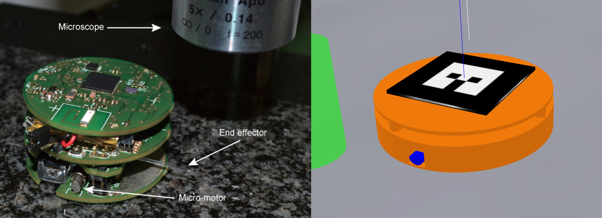
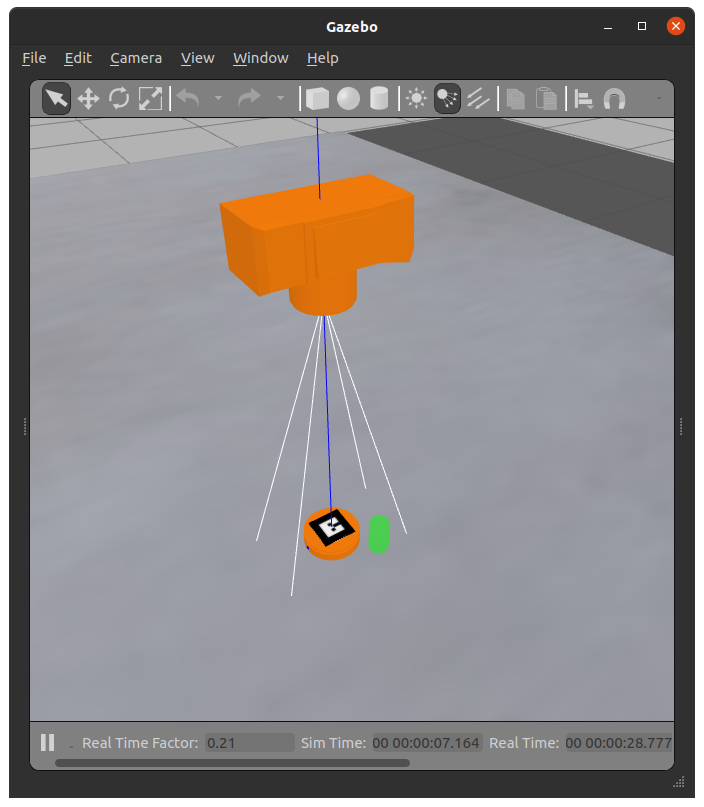

# Microbot

Microbot is an autonomous microrobot, driven by two vibrating micromotors, that
is able to perform translational and rotational sliding with micrometer
positioning accuracy.

The dynamics, design and simulations of the robot have been
studied before by [Kostas Vlachos](https://www.cs.uoi.gr/~kostaswl/files/home.html),
my supervising professor, in collaboration with other professors. My goal is to
simulate the robot for the first time in a physics simulation, develop a path
planning and control algorithm and then perform various tests that will
possibly lead to improvements on the real robot.

This repository focuses on developing the simulation in Gazebo and controlling
the microbot using ROS1 as part of my diploma thesis “Path Planing and
Simulation of a Mini-Robot Using Clothoids”.

  
   
  <i>Left, picture of microrobot's prototype. Right, visual representation in Gazebo.</i>

  
   
  <i>Gazebo simulation, microbot top down view camera and goal (green cylinder).</i>

For localization camera feed and an imu data are fuzed using robot_localization
ros package.

## List of related research

### Design

- [jdsmc06 - Dynamics, Design and
Simulation of a Novel
Microrobotic Platform Employing
Vibration Microactuators](http://nereus.mech.ntua.gr/Documents/pdf_ps/JDSMC06.pdf)
- [icra206 - Analysis, Design and Control of a Planar Micro-robot
Driven by Two Centripetal-Force Actuators](http://nereus.mech.ntua.gr/Documents/pdf_ps/ICRA206.pdf)
- [tro07 - Analysis and Experiments on the Force
Capabilities of Centripetal-Force-Actuated
Microrobotic Platforms](https://nereus.mech.ntua.gr/Documents/pdf_ps/tro07.pdf)
  
### Control

- [icra07 - On the Force Capabilities of Centripetal Force-actuated Microrobotic Platforms](https://www.cs.uoi.gr/~kostaswl/files/publications_files/ICRA07.pdf)
- [med13 - Speed Control of Vibration Micro-motors
of a Micro-Robotic Platform](https://www.cs.uoi.gr/~kostaswl/files/publications_files/MED13.pdf)
- [tase13 - Analysis and Motion Control of a Centrifugal-Force
Microrobotic Platform](https://www.cs.uoi.gr/~kostaswl/files/publications_files/TASE13.pdf)
- [etcae15 - Vibration-Driven Microrobot Positioning Methodologies
for Nonholonomic Constraint Compensation](https://www.cs.uoi.gr/~kostaswl/files/publications_files/ETCAE15.pdf)
- [med22 - Implementation and Motion Control of a Microrobot
Using Laser Sensors](https://www.cs.uoi.gr/~kostaswl/files/publications_files/MED22_2.pdf)

<!-- - [2007 aimo07 - A Haptic Tele-Manipulation Environment for a
Vibration-Driven Micromechatronic Device](https://www.cs.uoi.gr/~kostaswl/files/publications_files/AIM07.pdf) 
- [2008 jcise08 - haptic](https://www.cs.uoi.gr/~kostaswl/files/publications_files/JCISE08.pdf)
- [2014 setn14 - telemanipulation](https://www.cs.uoi.gr/~kostaswl/files/publications_files/SETN14.pdf)-->