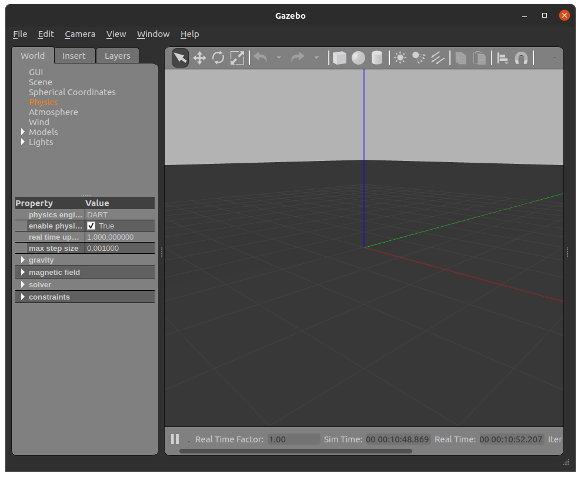
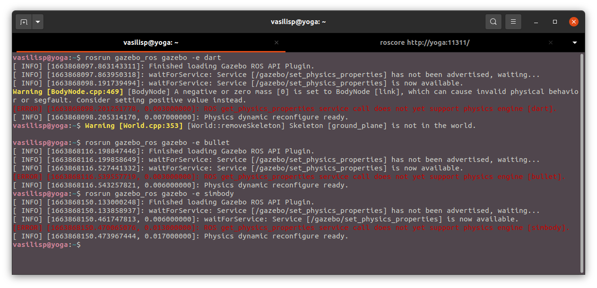
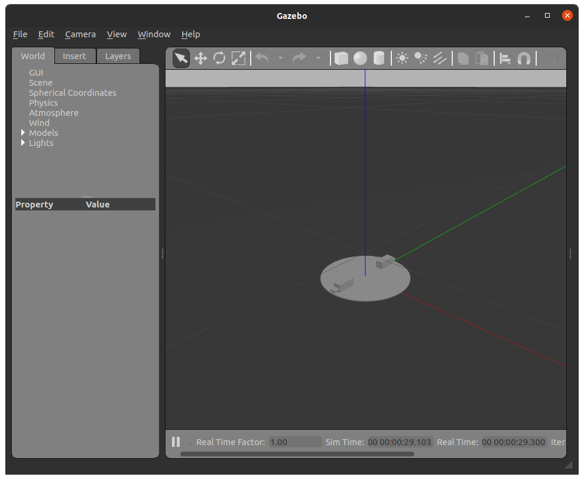
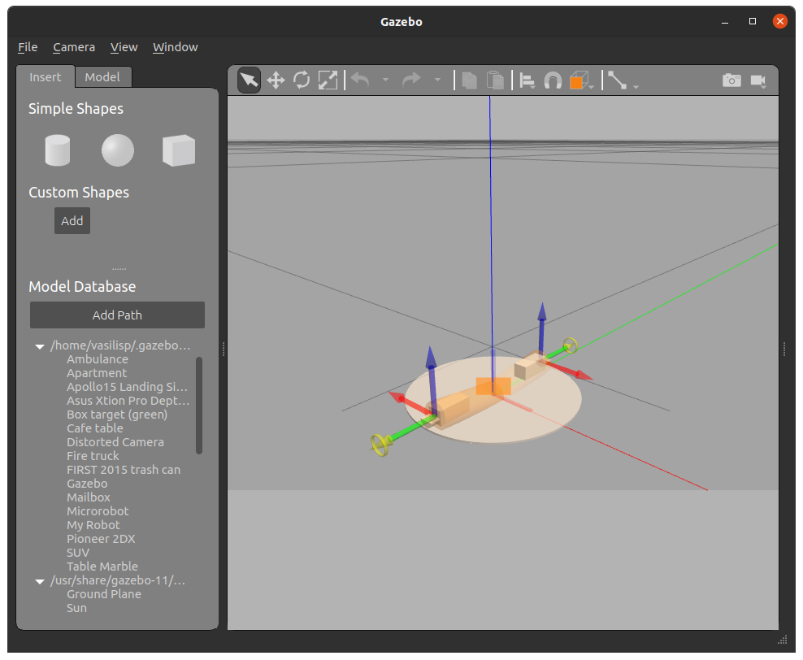
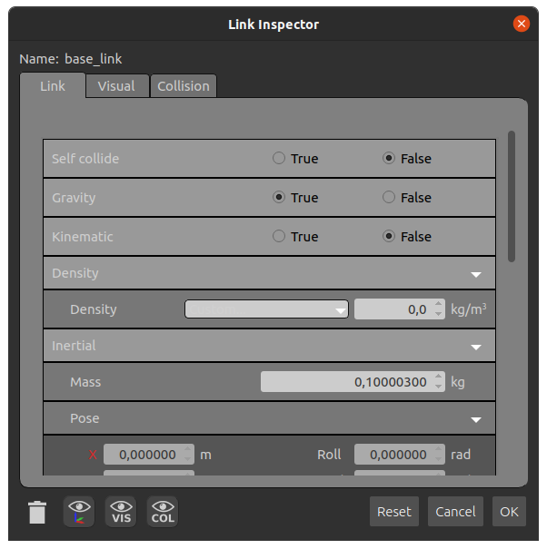
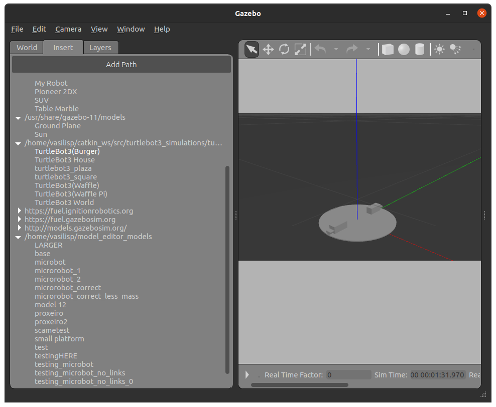
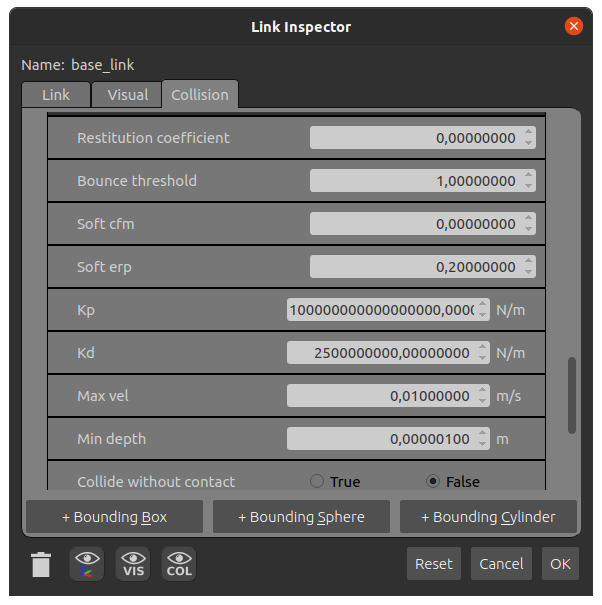

# Physics engines and instability problem

## Running Gazebo with one of the 4 supported physics engines

Gazebo [supports](https://classic.gazebosim.org/blog/four_physics)
4 different physics engines bullet, DART, Simbody and the
default ODE.

One can specify a physics engine as:

```shell
$rosrun gazebo_ros gazebo -e [ --physics ] arg 
```

where arg ode, bullet, dart or simbody. The gazebo then launches using a default
"empty" world where no robot models exist but there is a ground plane and a
light source (sun).

The selected engine name appears in the physics tab at the left part of the
gazebo gui.



### Problem

If any engine other than ode is selected the following error appears in the
terminal.

```shell
[ERROR] [1663868150.470065076, 0.013000000]: ROS get_physics_properties service 
call does not yet support physics engine [engine name].
```



In the [latest report](https://github.com/jsbruglie/grasp/issues/15),
that i found, of this issue is stated that the DART engine
works as expected despite of this error, get_physics_properties is a function
that is not yet implemented for other engines than ode.

In addition to this error DART physics engine throws 2 warnings. The first is
referring to a link in the world even though no links exist in the empty.world
loaded by default. The second may appears after the gazebo gui is closed where
ground_plane no longer exist, it is safe to ignore it.

## Going back to ODE

Due to the problem above i decided to go back to ODE and try to stabilize the
platform. I also noticed that sometimes the platform acts abnormally in DART.

In an effort to isolate the issue and make it easier for myself to fix the issue
i simplified the robot's xacro file so that no libraries are loaded, only links
and joints leaving me with ```simple_robot.xacro```.

### How to spawn the xacro in gazebo using any engine

To spawn the model in gazebo, run the ros master node

```shell
$rosrun roscore
```

then in another terminal launch gazebo

```shell
$rosrun gazebo_ros gazebo 
```

Gazebo can also run with -e tag as before.

Then in a third terminal the xacro file has to be converted to urdf.

```shell
$rosrun xacro xacro -o model.urdf simple_robot.urdf
```

where ```model.urdf``` is the name of the produced urdf.

Finally to spawn the urdf use:

```shell
$rosrun gazebo_ros spawn_model -file model.urdf -urdf -model microbot 
```

you should see the robot in the gazebo gui.



The robot can be edited by selecting right clicking it and selecting
"edit model".



### Further simplification, save the model for faster trial and error

Going into the model editor right click the robot and select link inspector.



Both links (collision tab) and joints have a lot of physical variables, so i
simplified the robot even further by removing the eccenters and links,
leaving only the platform of the robot (Selected them in the model editor and
pressed the delete key). I exited the model editor saving the model.

The instability of the platform was the same as before
the simplification of the model confirming that problem lies in the physics
parameters.

As i had the platform saved, i could edit the robot further using the model
editor, i could delete the model and drag and drop it in the gazebo world from
the insert tab (very bottom of the list "testing_microbot").



After a lot of trial and error, i noticed that the physics parameters that
affected the instability were Kp, Kd, and Min depth. A very brief explanation
for each one of those variables is given
[here](http://sdformat.org/spec?ver=1.9&elem=collision#bullet_kp).

I managed to stabilize the back support completely with the following values.

- kp = 10^16
- kd = 25* 10^8
- min_depth = 1 * 10^-6


